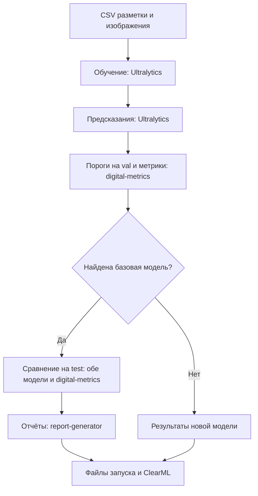

# clearml-yolo

`cy` обучает YOLO, получает предсказания и считает метрики. Если есть модель
для сравнения, команда сравнит результаты и подготовит отчёты. Для запуска нужны
изображения и CSV с разметкой — передайте его через `ground_truth`.

Обучение и предсказания выполняет **Ultralytics**, метрики считает **digital-metrics**,
отчёты создаёт **report-generator**. `cy` вызывает эти библиотеки по порядку
и сохраняет настройки и результаты в ClearML.

## Быстрый старт

### 1. Создайте конфигурацию

```bash
cy-init-config cy-config
```

Команда создаст каталог `cy-config` с примерами настроек.
Если каталог уже есть, существующие примеры сохранятся.

### 2. Укажите разметку и имя эксперимента

В `cy-config/cy.yaml` заполните `ground_truth` и секцию `clearml`:

```yaml
ground_truth: ./ground_truth.csv
clearml:
  project_name: detection
  task_name: yolo11n-first-run
  tags: [quickstart]
```

Замените путь к CSV, проект, имя задачи и теги на свои. Редактируйте эти поля
в созданном файле, сохраняя остальные настройки и список `defaults`.
Относительный путь `ground_truth` считается от каталога запуска команды.

В CSV должны быть непустые выборки `train`, `val` и `test` в столбце `split`.
`cy` использует это разбиение без изменений и сам готовит данные для обучения.
Пути к изображениям внутри CSV считаются от каталога CSV.
Описание столбцов и координат — в [формате входных данных](specs/004-ground-truth-training/contracts/cli.md).

### 3. Перенесите параметры Ultralytics

Параметры обучения запишите в `cy-config/ultralytics/default.yaml`. Например:

```yaml
model: yolo11n.pt
epochs: 100
imgsz: 640
batch: 16
device: -1
```

Параметры предсказаний — в `cy-config/ultralytics_predict/default.yaml`:

```yaml
batch: 8
conf: 0.001
iou: 0.7
device: -1
```

Измените эти поля в созданных файлах, сохраняя остальные настройки.
Пишите ключи без обёрток `ultralytics:` и `ultralytics_predict:`.
Поля `data`, `source`, `project` и `name` из Ultralytics переносить не нужно:
ими управляет `cy`. В обоих файлах оставьте `device: -1`, чтобы команда
дождалась свободного устройства. Для распределённого обучения см. [DDP и ожидание GPU](#ddp-и-ожидание-gpu).

### 4. Запустите `cy`

```bash
cy --config-dir cy-config --config-name cy
```

Для разового изменения параметра добавьте его к команде:

```bash
cy --config-dir cy-config --config-name cy ultralytics.epochs=50
```

Подробнее о YAML — в [описании конфигурации](specs/005-explicit-detection-config/contracts/native-configuration.md).



`cy` подбирает пороги на `val` и использует их при дальнейшей оценке.
Обе модели сравниваются на одних изображениях `test` с одинаковыми настройками предсказаний.

Для сравнения `cy` берёт модель из последней завершённой задачи с тегом `prod`
в том же проекте ClearML. Текущая задача в этот поиск не входит.
Если подходящей задачи нет, вы получите результаты новой модели без сравнения и отчётов.

В новом эксперименте `cy` заново запускает старую модель на выборке `test`
из текущего `ground_truth` и считает её метрики по этой разметке. Обе модели
оцениваются на актуальных данных, а не по результатам прежнего эксперимента.
Веса и ранее подобранные пороги старой модели сохраняются. Если повторить сравнение
в том же каталоге без изменения входов и настроек, готовые предсказания могут
использоваться повторно; метрики пересчитываются.

Чтобы выбрать модель сами, добавьте `compare.baseline_model.task_id=ID_ЗАДАЧИ`.
Если указанную модель не удастся загрузить, команда завершится с ошибкой.

### 5. Откройте результаты

В ClearML откройте проект `detection` и задачу `yolo11n-first-run`.
Все результаты `cy` собраны в одной задаче.

| Результат | Где искать |
|---|---|
| Настройки и ход выполнения | `Configuration`, `Console`, `Scalars` и `Plots` задачи ClearML |
| Лучшие веса `best.pt` | `Output Models` задачи обучения |
| Разметка и предсказания | Артефакты `gt_csv` и `predicts_csv` |
| Пороги и метрики | Артефакты порогов, панели метрик и графики |
| Сравнение и отчёты | Книги XLSX, если найдена базовая модель и сравнение выполнено |
| Локальные файлы | `runs/<проект>/<задача>-<task-id>/` с именами, пригодными для файловой системы |

Если хотите выбрать каталог сами, добавьте `run_dir=./runs/experiment-01`.
Для каждого запуска используйте новый каталог. Если загрузка обязательных файлов
в ClearML не удалась, команда сообщит об ошибке. Локальные файлы сохранятся.

## Переход с Ultralytics и ручных скриптов

Если сейчас вы вызываете библиотеки из CLI или Python-скрипта, таблица поможет
найти знакомые шаги в `cy`. Оценку через `digital-metrics` и отчёты нужно учитывать
отдельно от встроенной в Ultralytics проверки `val`.

| Шаг | Вручную через CLI или Python | Через `cy` |
|---|---|---|
| Данные | Подготовить YOLO-разметку для Ultralytics и таблицу разметки для оценки | Передать готовый CSV через `ground_truth`; данные для Ultralytics подготовит `cy` |
| Обучение | Вызвать Ultralytics `train`; найти лучшие веса | Обучить модель и передать полученные веса следующим стадиям |
| Предсказания | Вызвать Ultralytics `predict`; выгрузить рамки, классы и уверенность в CSV | Получить предсказания по выборкам и сохранить таблицы |
| Пороги | Передать результаты `val` в `digital-metrics`; сохранить пороги | Подобрать пороги на `val` и зафиксировать их для оценки |
| Метрики | Запустить `digital-metrics` с разметкой, предсказаниями и порогами | Рассчитать метрики и сохранить панели и графики |
| Сравнение | Загрузить две модели; запустить их на одной `test`; оценить обе через `digital-metrics` | Заново получить предсказания старой модели на текущей `test` и сравнить её с новой |
| Отчёты | Передать результаты сравнения двух моделей в `report-generator` | Создать технический и бизнес-отчёты из результатов сравнения |
| Учёт эксперимента | Связать параметры, файлы и публикацию в ClearML своим скриптом | Сохранить настройки, модель и файлы результатов в одной задаче |

### Как перенести параметры

Пишите параметры в формате `ключ=значение` — их читает Hydra.
Для разовых изменений в команде используйте префикс `ultralytics.` для обучения
и `ultralytics_predict.` для предсказаний. В соответствующих YAML-файлах пишите
те же ключи без префиксов, как в быстром старте.

| В Ultralytics | В `cy` | Примечание |
|---|---|---|
| `model=yolo11n.pt` | `ultralytics.model=yolo11n.pt` | Можно указать свои веса для дообучения |
| `data=data.yaml` | `ground_truth=./ground_truth.csv` | Передайте готовый CSV с разметкой |
| `epochs=100` | `ultralytics.epochs=100` | Число эпох обучения |
| `imgsz=640` | `ultralytics.imgsz=640` | Предсказания наследуют размер, пока он не задан отдельно |
| `batch=16` | `ultralytics.batch=16` | Пакет предсказаний задаётся отдельно: `ultralytics_predict.batch=8` |
| `device=...` | `ultralytics.device=-1` и `ultralytics_predict.device=-1` | Команда ждёт свободных устройств и выбирает их в порядке видимости |
| `amp=true`, `mosaic=1.0` | `ultralytics.amp=true`, `ultralytics.mosaic=1.0` | Нативные параметры обучения |
| `conf=0.001`, `iou=0.7` при предсказании | `ultralytics_predict.conf=0.001`, `ultralytics_predict.iou=0.7` | Параметры отбора предсказаний и NMS; не пороги итоговой оценки |
| `project=...`, `name=...` | `run_dir=...`, `clearml.project_name=...`, `clearml.task_name=...` | Каталог файлов и имя эксперимента задаются отдельно |

При переносе настроек обратите внимание:

- В `cy` по умолчанию заданы `imgsz=960`, `compile=true` и `nms=true`.
  В примере выше выбран размер `640`.
- Предсказания по умолчанию используют `conf=0.001`, `batch=1`, `rect=true`, `save=false`.
- Данные и классы берутся из CSV. Параметры Ultralytics `data`, `classes`, `fraction` и `single_cls`
  не управляют составом обучающего набора.
- `resume` не поддерживается. Для нового обучения из готовых весов укажите
  `ultralytics.model=/path/to/best.pt`.
- Вместо параметра Ultralytics `cfg` используйте файлы в `cy-config`, как в быстром старте.

Чтобы сравнить результат с прежним запуском, проверьте версии библиотек,
состав выборок и настройки обучения и предсказаний.

## Остальные команды

Если нужна только часть процесса, запустите её отдельно:

| Команда | Назначение |
|---|---|
| `cy-train` | Обучить модель по CSV разметки |
| `cy-predict` | Получить предсказания готовой модели и сохранить CSV |
| `cy-val` | Получить предсказания, подобрать пороги на `val` и оценить готовую модель |
| `cy-metrics` | Рассчитать метрики по готовым таблицам |
| `cy-compare` | Сравнить две модели на текущих изображениях; по умолчанию на `test` |
| `cy-report` | Создать отчёты из готового парного сравнения |
| `cy-ground-truth` | Дополнительная утилита: получить CSV из YOLO-разметки, если готового CSV ещё нет |
| `cy-init-config` | Создать примеры YAML для команд |
| `cy-dedup` | Объединить хранение одинаковых изображений в кэше через reflink |

Каждая из этих команд, кроме `cy-init-config` и `cy-dedup`, создаёт свою задачу ClearML.
Передайте ей нужные входные файлы. Список параметров — в [описании команд](specs/001-release-030/contracts/cli.md).

### Имя модели в результатах

Новые панели, локальные растровые графики и отчёты показывают имя исходной модели и полный ID задачи,
которая её обучила. При совпадении имён используется окончательное имя после
разрешения коллизии. В парных отчётах отдельно указаны базовая и новая модели;
подписи есть на каждом листе XLSX и повторяются при печати. Ширина печати
ограничена одной страницей, чтобы подпись не терялась на горизонтальных страницах.
Содержимое метрик, формулы, оформление и явные разрывы страниц по строкам сохраняются.

В ClearML Plots подписи интерактивных графиков содержат имя модели и выборку без
внутренних ID и контрольных сумм. `Confusion matrix` объединяет четыре режима:
`Counts` (по умолчанию), `Row %`, `Column %` и `Overall %`. `Precision-recall`
публикуется только для `test`: классы можно включать и отключать в легенде с AP50
и методом интегрирования, а подсказки показывают уверенность и накопленные TP/FP.
Пустые классы остаются в легенде с явным пояснением без вымышленных точек. Повторная оценка одного
чекпойнта на той же выборке использует прежнюю подпись; совпадающие имена разных
моделей получают понятный суффикс этапа и номер.

В Plots показана текущая модель. Графики базовой модели и таблицы сравнения,
ухудшившихся классов и методологии не публикуются в Plots; панели обеих моделей
и парные отчёты остаются доступны для скачивания. Сводные значения сравнения
сохраняются отдельно от Plots. Нативные PR-графики
валидации при обучении не загружаются; остальные графики, примеры изображений,
скаляры и загрузка лучшей модели сохраняются. Подробнее —
[контракт отображения графиков](specs/020-readable-evaluation-plots/contracts/plots.md).

Если у локальных весов или CSV нет сведений об исходной модели, укажите понятную
подпись: `model_label=local-model` для `cy-predict`, `cy-val`, `cy-metrics` и `cy`
с отключённым обучением. Для локальных ссылок в `cy-compare` задайте
`baseline_model.label=baseline` и `candidate_model.label=candidate`; для `cy-report`
со старым манифестом без сведений о моделях — `baseline_label=baseline` и
`candidate_label=candidate`. Подпись обязательна, если происхождение неизвестно;
она не регистрирует модель в ClearML, а ID обучения отображается как
`Training task: unavailable`. Сохранённое происхождение имеет приоритет над подписью.
Для Unicode и специальных символов сохраните внутренние кавычки Hydra:
например, `cy-metrics 'model_label="experiment-Ω"'` вместе с обязательными параметрами.

Переносите веса вместе с файлом `<checkpoint>.identity.json`, а предсказания —
с `<predictions.csv>.provenance.json`. Контрольные суммы связывают сведения о модели
с содержимым файлов; устаревший или несовместимый файл сведений вызывает ошибку.
Новые книги читаются через адаптеры проекта, которые сохраняют исходный формат
метрик для генерации отчётов и восстановления порогов. Существующие артефакты
ClearML не переписываются. Исходные метрики сохранены внутри книги в исходном формате;
контрольная сумма проверяет части XLSX перед чтением. Редактирование или повторное
сохранение книги с подписями приводит к отказу при загрузке, чтобы не использовать
устаревшие исходные метрики. Для изменений пересоздайте книгу из исходных данных.
Подробнее — в [контракте подписей](specs/014-evaluation-publication/contracts/publication.md#source-identity-on-new-results).

### Дедупликация изображений в кэше

Остановите запись в выбранный кэш и сначала проверьте кандидатов:

```bash
cy-dedup --dry-run
cy-dedup
cy-dedup /path/to/cache --dry-run
```

По умолчанию команда обходит `$CY_HOME/.cache`, а если `CY_HOME` не задан — `.cache`
в текущем каталоге. Отбираются обычные файлы изображений по расширению; символические
ссылки пропускаются. Совпасть должны имя файла целиком (с учётом регистра и расширения)
и содержимое. Одинаковые имена с разным содержимым остаются разными файлами.

На поддерживающей reflink файловой системе Linux копии разделяют блоки данных,
сохраняя независимость при последующей записи. Пути, содержимое, права, владелец,
atime/mtime и расширенные атрибуты сохраняются при замене; inode и ctime меняются.
Чтение файлов может обновлять atime. Команда выводит число изображений, дубликатов,
успешных reflink, пропусков и ошибок; это не измерение освобождённого места.
Неподдерживаемые reflink и пары на разных файловых системах пропускаются с сообщением;
неожиданные ошибки ввода-вывода завершают команду с ненулевым кодом.
`--dry-run` не создаёт и не заменяет файлы и не проверяет поддержку reflink.
ClearML и GPU не нужны. Подробности — в [контракте команды](specs/018-cache-image-dedup/contracts/cli.md).

## DDP и ожидание GPU

В параметрах `device` используйте `-1`, чтобы выбрать свободное устройство.
Нативные значения задают количество GPU; записанные номера не закрепляют
физические устройства. Свободные GPU выбираются в порядке видимости,
унаследованной через `CUDA_VISIBLE_DEVICES`.

Для распределённого обучения (DDP) в `cy-config/ultralytics/default.yaml`
замените `device: -1` на `device: [-1, -1]`. Два значения `-1` запрашивают
два устройства. DDP запускает сам Ultralytics; отдельный вызов `torchrun` не нужен.
В `cy-config/ultralytics_predict/default.yaml` оставьте `device: -1` —
для предсказаний достаточно одного устройства.

Команда ждёт, пока освободятся все необходимые GPU, затем выполняется в процессе,
из которого была запущена. Задача ClearML появляется после ожидания. `cpu` и `mps`
не проверяют доступность NVIDIA GPU. После обучения сохраняется очистка нативной
памяти; предсказания и сравнение используют первый выбранный GPU. Локальный
Hydra multirun выполняет задания последовательно стандартным BasicLauncher.

Очереди, билетов и резервирования нет. Одновременные команды могут выбрать один
GPU; порядок запуска и исключительное использование не гарантируются. Старые
файлы очереди не используются и не изменяются. Недоступная телеметрия NVML,
неподдерживаемые MIG и запрос сверх числа видимых GPU приводят к явной ошибке.

Подробнее — [правила ожидания и DDP](specs/022-simple-gpu-wait/contracts/execution.md)
и [пример запуска](specs/022-simple-gpu-wait/quickstart.md).

## Полезные настройки

**Каталоги.** По умолчанию результаты и служебные файлы хранятся в каталоге,
из которого вы запустили команду. `CY_HOME` позволяет выбрать другую рабочую папку,
а `run_dir` — отдельный каталог для результатов запуска.
Подробности — [правила размещения файлов](docs/filesystem-policy.md).

### FiftyOne

Интеграция с FiftyOne позволяет смотреть изображения, разметку и предсказания,
находить пропущенные объекты и лишние срабатывания. Матрица ошибок и графики
для полной выборки показывают те же результаты `digital-metrics`, что и `cy`.
Окно просмотра нужно открыть вручную. Как это сделать и работать с панелями оценки — в
[руководстве FiftyOne](specs/006-fiftyone-integration/quickstart.md).

## Обновление YAML и Python-интеграций

После перехода на новую структуру Python-модулей сохраните копию своих конфигураций
и пользовательских параметров, затем пересоздайте примеры:

```bash
cp -a cy-config cy-config.backup
cy-init-config cy-config --force
```

`--force` заменяет созданные примеры. Перенесите свои значения `ground_truth`,
настройки ClearML, параметры моделей и прочие переопределения из резервной копии
в новые файлы. Старые строки `_target_` со ссылками на `clearml_yolo.tasks`,
`clearml_yolo.apps` и прежние модули больше не поддерживаются. Названия CLI-команд,
обычные параметры Hydra, CSV и форматы результатов сохраняются.

Python-код теперь использует пакеты `core`, `application`, `adapters` и `entrypoints`.
При прямом вызове рабочего процесса передайте `deps` явно. Таблица переноса
импортов и пример вызова с владельцем задачи ClearML находятся в
[руководстве миграции Python](docs/python-import-migration.md).

## Если запуск не удался

| Проблема | Что проверить |
|---|---|
| Не найдены изображения или выборка | Пути в CSV и наличие непустых `train`, `val`, `test` |
| Ошибка конфигурации | Имя параметра и его группу; создайте актуальные примеры через `cy-init-config` в новом каталоге |
| Запуск ждёт GPU | Наличие достаточного числа видимых GPU без других вычислительных процессов; доступность NVML |
| Нет отчётов по сравнению | Наличие завершённой базовой задачи с тегом `prod` в выбранном проекте |

Предупреждения о сбоях содержат операцию, тип и описание ошибки, причину и
относящиеся к ней пути или идентификаторы. Например, `operation=write_receipt`
в предупреждении FiftyOne означает ошибку записи локальной квитанции, а
`operation=publish` — ошибку публикации в backend. Сбой необязательной
визуализации не отменяет успешное вычисление.

По умолчанию Loguru использует уровень `DEBUG`: вместе с кратким сообщением
выводится стек вызовов с файлами, строками и именами функций. Для краткого
вывода без диагностического стека задайте `LOGURU_LEVEL=INFO` перед запуском;
`LOGURU_LEVEL=DEBUG` возвращает подробности. Учётные данные в диагностике
скрываются; значения локальных переменных и строки исходного кода не выводятся.
Ошибки разрешения конфигурации сохраняют ограниченную диагностику, чтобы
не раскрывать значения секретов. Настройки логирования вызывающего приложения
при импорте библиотеки не меняются.

Полный список тем — в [документации проекта](docs/current-contracts.md).
