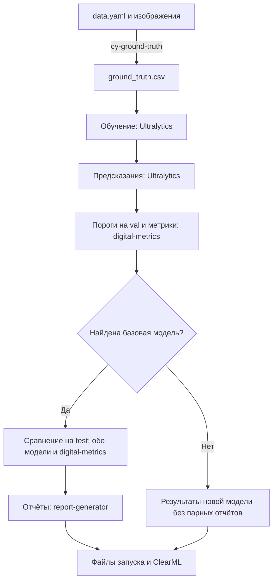

# clearml-yolo

`cy` запускает полный цикл оценки YOLO одной командой: обучение, предсказания,
подбор порогов, метрики, сравнение моделей и отчёты. Внутри работают **Ultralytics**,
**digital-metrics** и **report-generator**. Настройки и результаты сохраняются в ClearML.

Если вы уже запускаете эти библиотеки через CLI или Python, `cy` связывает стадии
и передаёт результаты между ними. Начните с вашего набора данных YOLO и файла `data.yaml`.

## Быстрый старт

Нужны `uv`, Python 3.12, изображения с разметкой YOLO и доступ к ClearML.
Для запуска на NVIDIA GPU нужны рабочие драйвер и PyTorch с поддержкой CUDA.
Пример ниже использует один GPU. Для CPU измените оба параметра устройства, как указано ниже.

### Установка

Клонируйте проект вместе с закреплёнными версиями зависимостей:

```bash
git clone --recurse-submodules https://github.com/BuckanovNikita/clearml-yolo.git
cd clearml-yolo
```

Добавьте в `pyproject.toml` локальную секцию источников. Если она уже есть, проверьте
её значения. Вторую секцию с тем же именем не добавляйте.

```toml
[tool.uv.sources]
digital-metrics = { path = "external/digital-metrics", editable = true }
report-generator = { path = "external/report-generator", editable = true }
```

Эта секция нужна для установки подмодулей, указанных в `uv.lock`.
Установите зависимости без изменения закреплённых версий:

```bash
uv sync --locked
```

Все команды ниже выполняйте из каталога проекта.

### 1. Настройте ClearML

Если ClearML ещё не настроен, запустите:

```bash
uv run clearml-init
```

Введите адреса сервера и учётные данные из вашего ClearML. Проверьте доступ
к серверу API и хранилищу артефактов. ClearML обязателен, в том числе для преобразования
разметки. Ключи доступа не добавляйте в YAML проекта.

### 2. Подготовьте данные

Замените `/data/dataset/data.yaml` на путь к вашему файлу:

```bash
uv run cy-ground-truth \
  data_yaml=/data/dataset/data.yaml \
  output=./ground_truth.csv \
  clearml.project_name=detection \
  clearml.task_name=prepare-data \
  clearml.tags='[quickstart]'
```

`cy` читает `ground_truth.csv` и готовит из него данные для Ultralytics.
Изображения должны оставаться доступны по путям из CSV.

Для полного запуска нужны непустые выборки `train`, `val` и `test`.
Если в исходном наборе нет непустой `test`, преобразование переносит в неё половину
изображений из `val` (`test_fraction=0.5`, `seed=0`). Готовая непустая `test` сохраняется.
Для очень маленькой `val` тестовая выборка может остаться пустой: подготовьте её до запуска.
Проверьте состав выборок, если сравниваете результат с прежним запуском Ultralytics.

Если у вас уже есть CSV нужного формата, пропустите преобразование.
Поля и правила описаны в [контракте входных данных](specs/004-ground-truth-training/contracts/cli.md).

### 3. Запустите `cy`

```bash
uv run cy \
  ground_truth=./ground_truth.csv \
  ultralytics.model=yolo11n.pt \
  ultralytics.epochs=100 \
  ultralytics.imgsz=640 \
  ultralytics.batch=16 \
  ultralytics.device=0 \
  ultralytics_predict.device=0 \
  clearml.project_name=detection \
  clearml.task_name=yolo11n-first-run \
  clearml.tags='[quickstart]'
```

Параметры в примере заданы явно. Выберите модель, размер изображения и размер пакета
для вашего набора данных и доступной памяти.

Для CPU замените **оба** значения устройства:
`ultralytics.device=cpu ultralytics_predict.device=cpu`.
Настройка устройства обучения не меняет устройство предсказаний.



Пороги подбираются на `val` и затем фиксируются. При сравнении обе модели получают
одни и те же текущие изображения `test` и общие настройки предсказаний.

Базовая модель по умолчанию — последняя завершённая задача с тегом `prod`
в том же проекте ClearML, кроме текущей задачи. Если такой задачи нет,
`cy` сохраняет результаты новой модели и пропускает сравнение и парные отчёты.
Для явного выбора добавьте `compare.baseline_model.task_id=ID_ЗАДАЧИ`.
Неверная явная ссылка завершает запуск с ошибкой.

### 4. Откройте результаты

В ClearML откройте проект `detection` и задачу запуска. Все стадии `cy` используют
одну задачу. Предварительный вызов `cy-ground-truth` создаёт отдельную задачу.

| Результат | Где искать |
|---|---|
| Настройки и ход выполнения | `Configuration`, `Console`, `Scalars` и `Plots` задачи ClearML |
| Лучшие веса `best.pt` | `Output Models` задачи обучения |
| Разметка и предсказания | Артефакты `gt_csv` и `predicts_csv` |
| Пороги и метрики | Артефакты порогов, панели метрик и графики |
| Сравнение и отчёты | Книги XLSX, если найдена базовая модель и сравнение выполнено |
| Локальные файлы | `runs/<проект>/<задача>-<task-id>/` с безопасными именами каталогов |

Для своего каталога добавьте `run_dir=./runs/experiment-01`.
Используйте новый каталог для каждого запуска. Ошибка обязательной загрузки в ClearML
завершает команду с ошибкой; локальные результаты остаются на месте.

## Переход с Ultralytics и ручных скриптов

Таблица показывает тот же стек библиотек. Метрики `digital-metrics` и парные отчёты —
отдельные стадии; обычный вызов Ultralytics `val` не заменяет весь этот процесс.

| Шаг | Вручную через CLI или Python | Через `cy` |
|---|---|---|
| Данные | Подготовить YOLO-разметку для Ultralytics и таблицу разметки для оценки | Один раз вызвать `cy-ground-truth`; передать CSV в `cy` |
| Обучение | Вызвать Ultralytics `train`; найти лучшие веса | Обучить модель и передать полученные веса следующим стадиям |
| Предсказания | Вызвать Ultralytics `predict`; выгрузить рамки, классы и уверенность в CSV | Получить предсказания по выборкам и сохранить таблицы |
| Пороги | Передать результаты `val` в `digital-metrics`; сохранить пороги | Подобрать пороги на `val` и зафиксировать их для оценки |
| Метрики | Запустить `digital-metrics` с разметкой, предсказаниями и порогами | Рассчитать метрики и сохранить панели и графики |
| Сравнение | Загрузить две модели; запустить их на одной `test`; оценить обе через `digital-metrics` | Выбрать базовую модель и сравнить её с новой на текущей `test` |
| Отчёты | Передать согласованные результаты двух моделей в `report-generator` | Создать технический и бизнес-отчёты из результатов сравнения |
| Учёт эксперимента | Связать параметры, файлы и публикацию в ClearML своим скриптом | Сохранить настройки, модель и обязательные артефакты в одной задаче |

### Как перенести параметры

Параметры передаются через Hydra в виде `ключ=значение`.
Группа `ultralytics` управляет обучением, `ultralytics_predict` — предсказаниями.

| В Ultralytics | В `cy` | Примечание |
|---|---|---|
| `model=yolo11n.pt` | `ultralytics.model=yolo11n.pt` | Можно указать свои веса для дообучения |
| `data=data.yaml` | `ground_truth=./ground_truth.csv` | Сначала преобразуйте разметку |
| `epochs=100` | `ultralytics.epochs=100` | Число эпох обучения |
| `imgsz=640` | `ultralytics.imgsz=640` | Предсказания наследуют размер, пока он не задан отдельно |
| `batch=16` | `ultralytics.batch=16` | Пакет предсказаний задаётся отдельно: `ultralytics_predict.batch=8` |
| `device=0` | `ultralytics.device=0` и `ultralytics_predict.device=0` | Обучение и предсказания используют отдельные настройки |
| `amp=true`, `mosaic=1.0` | `ultralytics.amp=true`, `ultralytics.mosaic=1.0` | Нативные параметры обучения |
| `conf=0.001`, `iou=0.7` при предсказании | `ultralytics_predict.conf=0.001`, `ultralytics_predict.iou=0.7` | Параметры отбора предсказаний и NMS; не пороги итоговой оценки |
| `project=...`, `name=...` | `run_dir=...`, `clearml.project_name=...`, `clearml.task_name=...` | Каталог файлов и имя эксперимента задаются отдельно |

Учитывайте отличия перед переносом запуска:

- В `cy` по умолчанию заданы `imgsz=960`, `compile=true` и `nms=true`.
  В основном примере размер явно изменён на `640`.
- Предсказания по умолчанию используют `conf=0.001`, `batch=1`, `rect=true`, `save=false`.
- Данные и классы определяются CSV. Нативные `data`, `classes`, `fraction` и `single_cls`
  не управляют составом обучающего набора.
- `resume` не поддерживается. Для нового обучения из готовых весов укажите
  `ultralytics.model=/path/to/best.pt`.
- Не передавайте нативный `cfg`. Используйте группы настроек, показанные ниже.

Одинаковые названия параметров не гарантируют одинаковые результаты.
Сверьте версии библиотек, состав выборок и все настройки.

## Конфигурация в YAML

Создайте редактируемые примеры:

```bash
uv run cy-init-config ./conf
```

Измените `conf/cy.yaml`, `conf/ultralytics/default.yaml` и при необходимости
`conf/ultralytics_predict/default.yaml`. Заполните обязательные поля `???`, задайте
проект и теги ClearML. Затем запустите:

```bash
uv run cy --config-dir=./conf --config-name=cy
```

`cy-init-config` работает без ClearML и не перезаписывает существующие примеры.
Параметры командной строки можно добавлять к запуску с YAML.
Подробности — в [контракте конфигурации](specs/005-explicit-detection-config/contracts/native-configuration.md).

## Остальные команды

Используйте отдельную команду, если нужна одна стадия. Для полного процесса начинайте с `cy`.

| Команда | Назначение |
|---|---|
| `cy-train` | Обучить модель по CSV разметки |
| `cy-predict` | Получить предсказания готовой модели и сохранить CSV |
| `cy-val` | Получить предсказания, подобрать пороги на `val` и оценить готовую модель |
| `cy-metrics` | Рассчитать метрики по готовым таблицам |
| `cy-compare` | Сравнить две модели на текущих изображениях; по умолчанию на `test` |
| `cy-report` | Создать отчёты из готового парного сравнения |
| `cy-ground-truth` | Преобразовать YOLO-разметку из `data.yaml` в CSV |
| `cy-init-config` | Создать примеры YAML для команд |

У каждой команды исполнения своя задача ClearML. Исключение — `cy-init-config`.
Входные файлы для отдельных стадий нужно передавать явно.
Схемы входов описаны в [контракте CLI](specs/001-release-030/contracts/cli.md).

## Полезные настройки

**GPU.** Модельные команды ожидают свободные NVIDIA GPU в общей очереди пользователя
в пределах одной ОС. Число устройств определяется параметром `device`.
При обучении `device=2` запрашивает один GPU, `device=[0,1]` — два.
Очередь назначает свободные устройства; записанные номера не закрепляют физические GPU.
CPU не ожидает эту очередь. Подробнее — [правила очереди](specs/013-gpu-experiment-queue/contracts/queue-state.md).

**Каталоги.** По умолчанию файлы создаются относительно каталога запуска.
`CY_HOME` меняет корень рабочих файлов, `run_dir` — каталог конкретного запуска.
Подробности — [правила размещения файлов](docs/filesystem-policy.md).

### FiftyOne

Публикация в FiftyOne включена по умолчанию. Для отключения добавьте
`fiftyone.enabled=false`. Ошибка визуализации выводит предупреждение и не прерывает
вычисления. Интерфейс просмотра автоматически не открывается.
Настройка, просмотр и панели оценки описаны в
[руководстве FiftyOne](specs/006-fiftyone-integration/quickstart.md).

## Если запуск не удался

| Проблема | Что проверить |
|---|---|
| Нет доступа к ClearML или не загружаются файлы | Учётные данные, адреса API и доступ к хранилищу артефактов |
| Не найдены изображения или выборка | Пути в CSV и наличие непустых `train`, `val`, `test` |
| Ошибка конфигурации | Имя параметра и его группу; создайте актуальные примеры через `cy-init-config` в новом каталоге |
| Запуск ожидает GPU | Наличие свободных устройств и порядок запросов в очереди |
| Нет парных отчётов | Наличие завершённой базовой задачи с тегом `prod` в выбранном проекте |

Подробные правила собраны в [указателе контрактов](docs/current-contracts.md).
Проверки кода и работа с Git описаны в [руководстве разработчика](docs/development.md).
