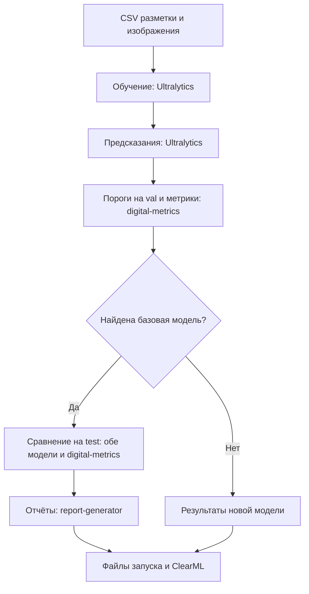

# clearml-yolo

`cy` обучает YOLO, получает предсказания и считает метрики. Если есть модель
для сравнения, команда сравнит результаты и подготовит отчёты. Для запуска нужны
изображения и CSV с разметкой — передайте его через `ground_truth`.

Обучение и предсказания выполняет **Ultralytics**, метрики считает **digital-metrics**,
отчёты создаёт **report-generator**. `cy` вызывает эти библиотеки по порядку
и сохраняет настройки и результаты в ClearML.

## Быстрый старт

Для запуска нужны `uv`, Python 3.12, CSV с разметкой, изображения и доступ к ClearML.

### Установка

Клонируйте проект вместе с закреплёнными версиями зависимостей:

```bash
git clone --recurse-submodules https://github.com/BuckanovNikita/clearml-yolo.git
cd clearml-yolo
```

Теперь установите зависимости в версиях из `uv.lock`:

```bash
uv sync --frozen
```

Все команды ниже выполняйте из каталога проекта. Флаг `--frozen` сохраняет
версии зависимостей из `uv.lock`.

### 1. Настройте ClearML

Если ClearML ещё не настроен, запустите:

```bash
uv run --frozen clearml-init
```

Введите адреса сервера и учётные данные из вашего ClearML. Для работы `cy`
нужен доступ к API и хранилищу файлов. Сохраните ключи через `clearml-init`;
в YAML проекта их добавлять не нужно.

### 2. Укажите разметку

В команде ниже замените `./ground_truth.csv` на путь к вашему CSV с разметкой.
`cy` сам подготовит из него данные для обучения и оценки.

В столбце `split` должны быть непустые выборки `train`, `val` и `test`.
`cy` использует это разбиение без изменений. Проверьте, что изображения доступны
по путям из CSV: относительные пути считаются от каталога CSV.
Описание столбцов и координат — в [формате входных данных](specs/004-ground-truth-training/contracts/cli.md).

### 3. Запустите `cy`

```bash
uv run --frozen cy \
  ground_truth=./ground_truth.csv \
  ultralytics.model=yolo11n.pt \
  ultralytics.epochs=100 \
  ultralytics.imgsz=640 \
  ultralytics.batch=16 \
  ultralytics.device=-1 \
  ultralytics_predict.device=-1 \
  clearml.project_name=detection \
  clearml.task_name=yolo11n-first-run \
  clearml.tags='[quickstart]'
```

Замените модель и параметры обучения на свои. В обоих параметрах `device`
оставьте `-1`: свободное устройство выберет очередь. Как запросить несколько
устройств для DDP, описано в разделе [«DDP и очередь»](#ddp-и-очередь).



`cy` подбирает пороги на `val` и использует их при дальнейшей оценке.
Обе модели сравниваются на одних изображениях `test` с одинаковыми настройками предсказаний.

Для сравнения `cy` берёт модель из последней завершённой задачи с тегом `prod`
в том же проекте ClearML. Текущая задача в этот поиск не входит.
Если подходящей задачи нет, вы получите результаты новой модели без сравнения и отчётов.

Чтобы выбрать модель сами, добавьте `compare.baseline_model.task_id=ID_ЗАДАЧИ`.
Если указанную модель не удастся загрузить, команда завершится с ошибкой.

### 4. Откройте результаты

В ClearML откройте проект `detection` и задачу `yolo11n-first-run`.
Все результаты `cy` собраны в одной задаче.

| Результат | Где искать |
|---|---|
| Настройки и ход выполнения | `Configuration`, `Console`, `Scalars` и `Plots` задачи ClearML |
| Лучшие веса `best.pt` | `Output Models` задачи обучения |
| Разметка и предсказания | Артефакты `gt_csv` и `predicts_csv` |
| Пороги и метрики | Артефакты порогов, панели метрик и графики |
| Сравнение и отчёты | Книги XLSX, если найдена базовая модель и сравнение выполнено |
| Локальные файлы | `runs/<проект>/<задача>-<task-id>/` с именами, пригодными для файловой системы |

Если хотите выбрать каталог сами, добавьте `run_dir=./runs/experiment-01`.
Для каждого запуска используйте новый каталог. Если загрузка обязательных файлов
в ClearML не удалась, команда сообщит об ошибке. Локальные файлы сохранятся.

## Переход с Ultralytics и ручных скриптов

Если сейчас вы вызываете библиотеки из CLI или Python-скрипта, таблица поможет
найти знакомые шаги в `cy`. Оценку через `digital-metrics` и отчёты нужно учитывать
отдельно от встроенной в Ultralytics проверки `val`.

| Шаг | Вручную через CLI или Python | Через `cy` |
|---|---|---|
| Данные | Подготовить YOLO-разметку для Ultralytics и таблицу разметки для оценки | Передать готовый CSV через `ground_truth`; данные для Ultralytics подготовит `cy` |
| Обучение | Вызвать Ultralytics `train`; найти лучшие веса | Обучить модель и передать полученные веса следующим стадиям |
| Предсказания | Вызвать Ultralytics `predict`; выгрузить рамки, классы и уверенность в CSV | Получить предсказания по выборкам и сохранить таблицы |
| Пороги | Передать результаты `val` в `digital-metrics`; сохранить пороги | Подобрать пороги на `val` и зафиксировать их для оценки |
| Метрики | Запустить `digital-metrics` с разметкой, предсказаниями и порогами | Рассчитать метрики и сохранить панели и графики |
| Сравнение | Загрузить две модели; запустить их на одной `test`; оценить обе через `digital-metrics` | Выбрать базовую модель и сравнить её с новой на текущей `test` |
| Отчёты | Передать результаты сравнения двух моделей в `report-generator` | Создать технический и бизнес-отчёты из результатов сравнения |
| Учёт эксперимента | Связать параметры, файлы и публикацию в ClearML своим скриптом | Сохранить настройки, модель и файлы результатов в одной задаче |

### Как перенести параметры

Пишите параметры в формате `ключ=значение` — их читает Hydra.
Для обучения используйте префикс `ultralytics.`, для предсказаний — `ultralytics_predict.`.

| В Ultralytics | В `cy` | Примечание |
|---|---|---|
| `model=yolo11n.pt` | `ultralytics.model=yolo11n.pt` | Можно указать свои веса для дообучения |
| `data=data.yaml` | `ground_truth=./ground_truth.csv` | Передайте готовый CSV с разметкой |
| `epochs=100` | `ultralytics.epochs=100` | Число эпох обучения |
| `imgsz=640` | `ultralytics.imgsz=640` | Предсказания наследуют размер, пока он не задан отдельно |
| `batch=16` | `ultralytics.batch=16` | Пакет предсказаний задаётся отдельно: `ultralytics_predict.batch=8` |
| `device=...` | `ultralytics.device=-1` и `ultralytics_predict.device=-1` | Свободные устройства назначает очередь |
| `amp=true`, `mosaic=1.0` | `ultralytics.amp=true`, `ultralytics.mosaic=1.0` | Нативные параметры обучения |
| `conf=0.001`, `iou=0.7` при предсказании | `ultralytics_predict.conf=0.001`, `ultralytics_predict.iou=0.7` | Параметры отбора предсказаний и NMS; не пороги итоговой оценки |
| `project=...`, `name=...` | `run_dir=...`, `clearml.project_name=...`, `clearml.task_name=...` | Каталог файлов и имя эксперимента задаются отдельно |

При переносе настроек обратите внимание:

- В `cy` по умолчанию заданы `imgsz=960`, `compile=true` и `nms=true`.
  В примере выше выбран размер `640`.
- Предсказания по умолчанию используют `conf=0.001`, `batch=1`, `rect=true`, `save=false`.
- Данные и классы берутся из CSV. Параметры Ultralytics `data`, `classes`, `fraction` и `single_cls`
  не управляют составом обучающего набора.
- `resume` не поддерживается. Для нового обучения из готовых весов укажите
  `ultralytics.model=/path/to/best.pt`.
- Вместо параметра Ultralytics `cfg` используйте YAML-конфигурацию из следующего раздела.

Чтобы сравнить результат с прежним запуском, проверьте версии библиотек,
состав выборок и настройки обучения и предсказаний.

## Конфигурация в YAML

Создайте редактируемые примеры:

```bash
uv run --frozen cy-init-config ./conf
```

Измените `conf/cy.yaml`, `conf/ultralytics/default.yaml` и при необходимости
`conf/ultralytics_predict/default.yaml`. Заполните обязательные поля `???`, задайте
проект и теги ClearML. В обеих группах `ultralytics` и `ultralytics_predict`
задайте `device: -1`. Для DDP в обучающей группе укажите `device: [-1, -1]`.
Затем запустите:

```bash
uv run --frozen cy --config-dir=./conf --config-name=cy
```

`cy-init-config` работает без ClearML и не перезаписывает существующие примеры.
Параметры командной строки можно добавлять к запуску с YAML.
Подробнее — в [описании конфигурации](specs/005-explicit-detection-config/contracts/native-configuration.md).

## Остальные команды

Если нужна только часть процесса, запустите её отдельно:

| Команда | Назначение |
|---|---|
| `cy-train` | Обучить модель по CSV разметки |
| `cy-predict` | Получить предсказания готовой модели и сохранить CSV |
| `cy-val` | Получить предсказания, подобрать пороги на `val` и оценить готовую модель |
| `cy-metrics` | Рассчитать метрики по готовым таблицам |
| `cy-compare` | Сравнить две модели на текущих изображениях; по умолчанию на `test` |
| `cy-report` | Создать отчёты из готового парного сравнения |
| `cy-ground-truth` | Дополнительная утилита: получить CSV из YOLO-разметки, если готового CSV ещё нет |
| `cy-init-config` | Создать примеры YAML для команд |

Каждая из этих команд, кроме `cy-init-config`, создаёт свою задачу ClearML.
Передайте ей нужные входные файлы. Список параметров — в [описании команд](specs/001-release-030/contracts/cli.md).

## DDP и очередь

В параметрах `device` используйте `-1`, чтобы очередь выбрала свободное устройство.
Номера физических устройств указывать не нужно.

Для распределённого обучения (DDP) замените в основной команде
`ultralytics.device=-1` на `ultralytics.device='[-1,-1]'`.
Два значения `-1` запрашивают два устройства. DDP запускает сам Ultralytics;
отдельный вызов `torchrun` не нужен. Для предсказаний оставьте
`ultralytics_predict.device=-1` — им достаточно одного устройства.

Очередь общая для запусков одного пользователя в пределах одной ОС.
Запросы получают устройства в порядке поступления. DDP ждёт, пока освободятся
сразу все запрошенные устройства; более поздний запрос его не обгоняет.
Задача ClearML появится после ожидания. По завершении обучения `cy` оставляет
одно устройство для предсказаний и сравнения, а остальные освобождает.

Подробнее — [правила очереди](specs/013-gpu-experiment-queue/contracts/queue-state.md)
и [запуска DDP](specs/013-gpu-experiment-queue/contracts/execution.md).

## Полезные настройки

**Каталоги.** По умолчанию результаты и служебные файлы хранятся в каталоге,
из которого вы запустили команду. `CY_HOME` позволяет выбрать другую рабочую папку,
а `run_dir` — отдельный каталог для результатов запуска.
Подробности — [правила размещения файлов](docs/filesystem-policy.md).

### FiftyOne

Результаты по умолчанию сохраняются и в FiftyOne для просмотра изображений и рамок.
Если это не нужно, добавьте `fiftyone.enabled=false`. При ошибке FiftyOne
вы увидите предупреждение, а расчёты продолжатся. Окно просмотра нужно открыть вручную.
Настройка, просмотр и панели оценки описаны в
[руководстве FiftyOne](specs/006-fiftyone-integration/quickstart.md).

## Если запуск не удался

| Проблема | Что проверить |
|---|---|
| Нет доступа к ClearML или не загружаются файлы | Учётные данные, адреса API и доступ к хранилищу артефактов |
| Не найдены изображения или выборка | Пути в CSV и наличие непустых `train`, `val`, `test` |
| Ошибка конфигурации | Имя параметра и его группу; создайте актуальные примеры через `cy-init-config` в новом каталоге |
| Запуск ждёт в очереди | Наличие свободных устройств и порядок запросов в очереди |
| Нет отчётов по сравнению | Наличие завершённой базовой задачи с тегом `prod` в выбранном проекте |

Полный список тем — в [документации проекта](docs/current-contracts.md).
Проверки кода и работа с Git описаны в [руководстве разработчика](docs/development.md).
